# Laporan Jarkom Modul 4 Kelompok K-36

## Anggota

| Nama | NRP|
|-------------------------------|---------------|
| Ahmad Wildan Fawwaz| 5027241001 |
| Muhammad Rakha Hananditya R.| 5027241015 |

## Asisten Penguji
| Nama | Kode Asisten |
|-----------------------|----|
| Adlya Isriena Aftarisya | P6 |

## Pendahuluan

بِسْمِ اللَّهِ الرَّحْمَنِ الرَّحِيْمِ

&emsp; Segala puji syukur kita panjatkan atas kehadirat Allah Subḥānahu wa Ta‘ālā, karena berkat atas rahmat, karunia, dan nikmat-Nya praktikum modul 1 untuk mata kuliah Komunikasi Data dan Jaringan Komputer dapat diselesaikan dengan cukup. Tidak lupa shalawat serta salam semoga senantiasa tercurah kepada junjungan kita Nabi Muhammad Shallallāhu ‘alaihi wa Sallam, suri teladan terbaik bagi umat manusia, beserta keluarga, sahabat, dan para pengikutnya hingga akhir zaman.

&emsp; Laporan ini disusun sebagai suatu bentuk pertanggungjawaban akademik atas kegiatan praktikum yang telah dilaksanakan. Selain itu, laporan ini berfungsi sebagai dokumentasi resmi tertulis dari seluruh rangkaian kegiatan yang telah dilakukan, sehingga dapat menjadi acuan dalam evaluasi maupun penilaian praktikum.

Rasulullah Shallallāhu ‘alaihi wa Sallam pernah bersabda:

إِذَا مَاتَ ابْنُ آدَمَ انْقَطَعَ عَمَلُهُ إِلَّا مِنْ ثَلَاثٍ: صَدَقَةٍ جَارِيَةٍ، أَوْ عِلْمٍ يُنْتَفَعُ بِهِ، أَوْ وَلَدٍ صَالِحٍ يَدْعُو لَهُ

<em>Artinya</em>:

"Apabila anak Adam meninggal dunia, maka terputuslah amalnya kecuali tiga perkara: sedekah jariyah, ilmu yang bermanfaat, atau anak shalih yang mendoakannya." 
 
(HR. Muslim, no. 1631)

  
وَمَنْ سَلَكَ طَرِيقًا يَلْتَمِسُ فِيهِ عِلْمًا سَهَّلَ اللَّهُ لَهُ بِهِ طَرِيقًا إِلَى الْجَنَّةِ

<em>Artinya</em>:

"Barang siapa yang menempuh jalan untuk mencari ilmu, maka Allah akan mudahkan baginya jalan menuju surga." 
  
(HR. Muslim, no. 2699)

  

&emsp; Maka dari itu, semoga apa yang tertulis pada laporan ini dapat menjadi ilmu yang bermanfaat, serta menjadi keberkahan dan amal yang diterima di sisi Allah Subḥānahu wa Ta‘ālā. Semoga bagi yang membaca ini, Allah memudahkan semua langkahnya dalam menuntut ilmu, mengamalkannya, serta menjaganya agar tidak sekadar menjadi hafalan, namun juga menjadi bekal yang membawanya ke surga.

Āmīn yā Rabbal ‘ālamīn.

## Daftar Isi

- [Anggota](#anggota)
- [Pendahuluan](#pendahuluan)
- [Daftar Isi](#daftar-isi)
- [Walkthrough](#walkthrough)

## Walkthrough

### • VLSM - CPT

Langkah2:  

&emsp; Langkah pertama adalah menyusun topologi jaringannya terlebih dahulu sesuai ketentuan soal.

	  

&emsp; Menghitung total host terlebih dahulu, diperoleh ada 3219 host. Lalu mengurutkan/sort dari subnet yang memiliki host paling banyak sampai ke yang paling dikit.

	  

&emsp; Membuat tabel nama subnet, rute, jumlah IP, dan netmask untuk memastikan IP yang digunakan secara maksimal dan menyesuaikan dengan netmasknya.

	  

&emsp; Pembuatan tabel kedua yang berisi subnet, network ID, netmask, broadcast, range IP. Tujuannya sendiri untuk menghitung IP bersih yang dapat dipakai setelah dikurangi penggunaan oleh network ID dan broadcast dan mengetahui range IP yang available buat dipakai.

	  

&emsp; Setelah perhitungan selesai, lalu implementasi yang ada dari tabel ke topologi di VLSM

	  

### • CIDR - GNS3

#### - Topologi GNS3

	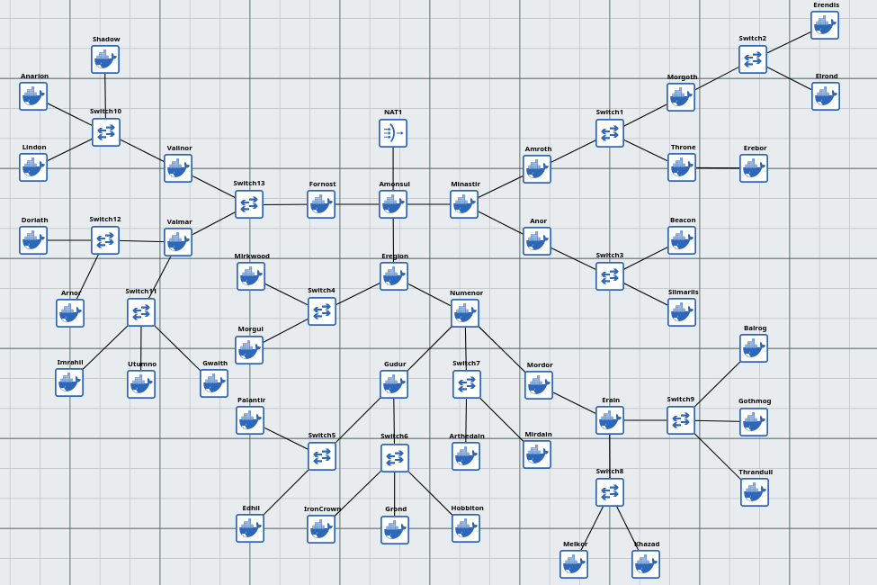  

#### - Pemetaan Subnet Topologi

	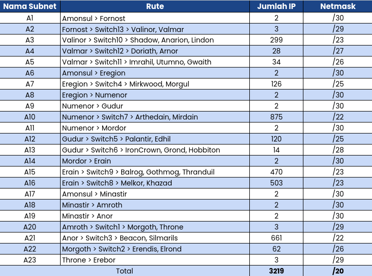  

#### - Supernetting Series B

	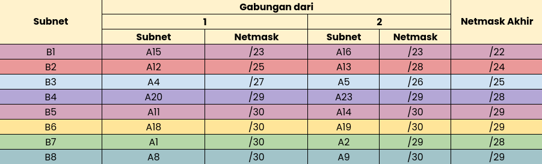  

#### - Supernetting Series C

	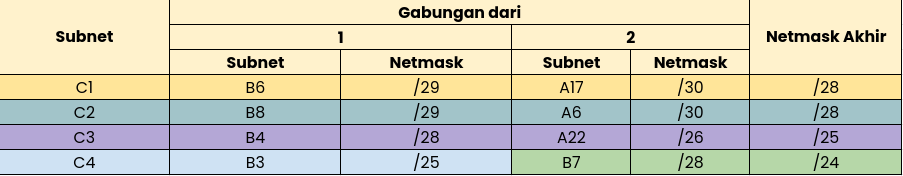  

#### • Supernetting Series D

	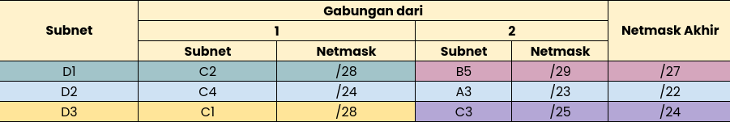  

#### - Supernetting Series E

	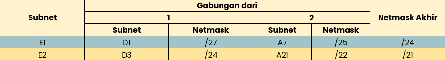  

#### - Supernetting Series F

	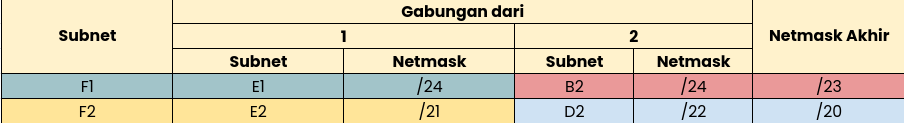  

#### - Supernetting Series G

	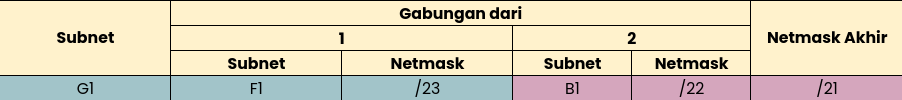  

#### - Supernetting Series H

	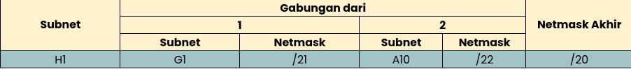  

#### - Supernetting Series I

	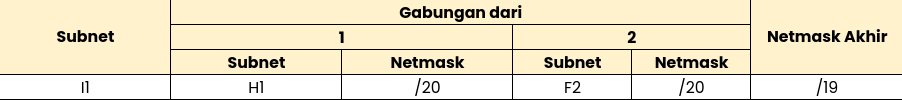  

#### - Pembagian IP Supernet Topologi

	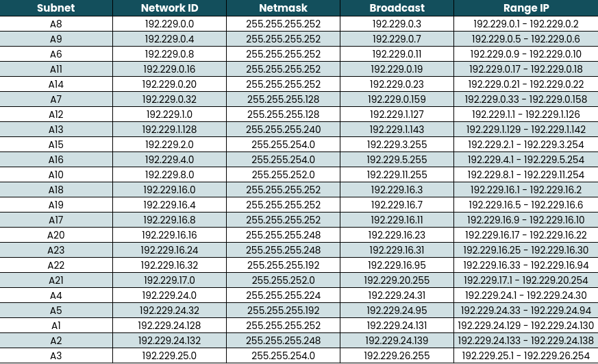  

#### - Tree Pembagian Series I1

	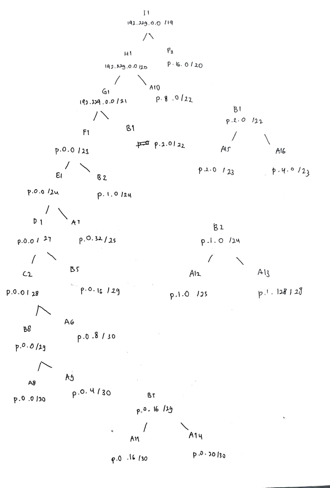  

#### - Tree Pembagian Series F2

	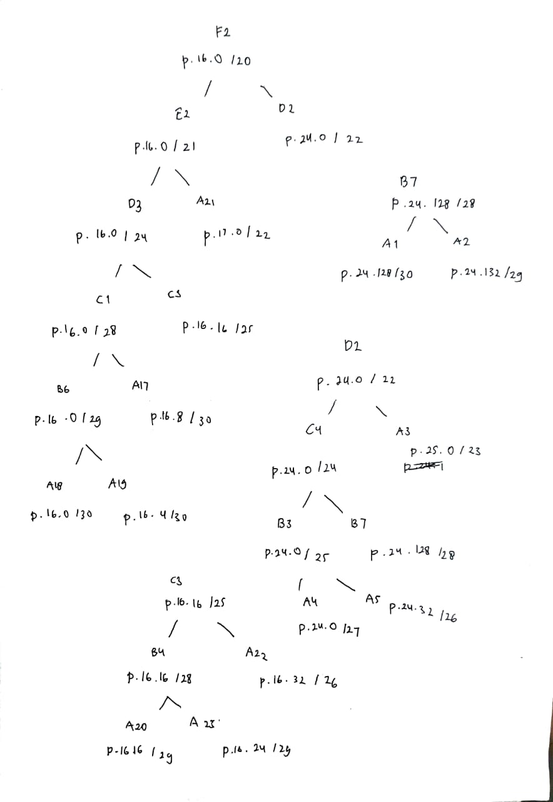  

